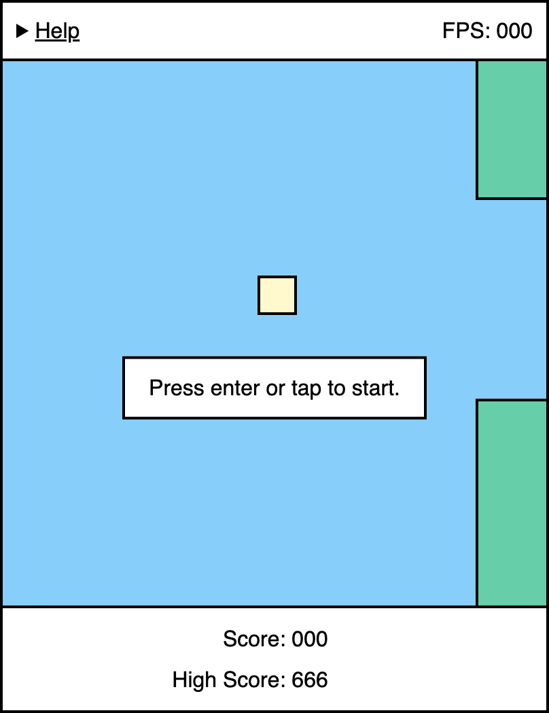
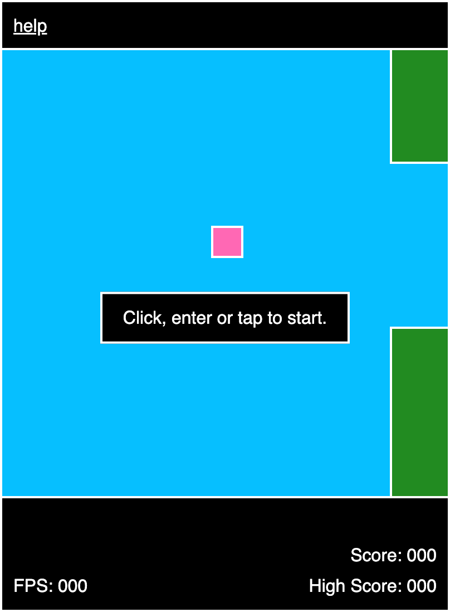

# Flappy Bird 

https://nhooyr.github.io/flappy-bird/

I wrote this minimal demo game for a short presentation I gave at the [Kaslo, BC
highschool](https://jvh.sd8.bc.ca/) to freshmen and sophmores in early 2023 on how HTML,
CSS and JavaScript integrate together.

> \*warning\*: This game is very addictive. Play at your own peril.

## Minimal?

Flappy Bird as implemented in this repo has a decent amount of code and complexity to it.
It would thus be fair to argue it is not as minimal as it could be.

However, by minimal I mean the least amount of code while still behaving correctly. The
game loop for example could be much simpler. Instead of stepping through and being able to
render partial/multiple time units it could throttle the frame rate to 60fps.

But then on higher FPS devices the game wouldn't run as smooth and devices that cannot
keep up to 60 fps, the time velocity in the game would change. It would become slower and
thus easier.

The game could also immediately process flap inputs instead of deferring them to be
processed in the render loop based on their timestamp and thus as part of the correct time
unit. But then on lagging devices, multiple inputs could appear to be processed all at
once in a single time unit instead of being applied in the time unit on which they were
received.

All of which would be incorrect behaviour and is thus not minimal by the definition given
above but rather incomplete.

## Presentation

The presentation is in [./pres](./pres) and accessible at
https://nhooyr.github.io/flappy-bird/pres/.

See the help log in the console for how to navigate between the slides.

<a href="https://nhooyr.github.io/flappy-bird/pres/" >
  <!-- kbd is for adding a border around the preview. -->
  <kbd>
    
  </kbd>
</a>
<!-- Do not know why but two br are required to separate the kbd border from below -->
  

### Discussion Points

I have included a list of all the potential discussion points I could come up with below.
In my short presentation I did not get to them all. I only covered the points in the
slides above. Then I let them read the code, make adjustments, play and ask me questions
in a free-form format.

- The HTML structure.
  - The details HTML element for collapsible help which is relatively unknown method for
    providing expandable information without javascript.
- How the CSS works to position the elements and keep the game centered.
  Including on mobile.
  - How dark mode works.
- How the game loop runs and handles both high refresh rates and lag.
  - How the FPS meter works.
  - The interpolation equation used for calculating the next point of the bird is derived
    from the one of the core kinematics equation that they'll be learning in Junior Year
    Physics. `0.5*(v + v0)*t` to `(v0 + 0.5*vd)*t`. The derivation is in `Game.stepOne()`
    in [./index.js](./index.js).

> Diagram generated from [./pres/game-loop.d2](./pres/game-loop.d2).

- The bird falling from gravity in the shape of a parabola. Very relevant to them as they
  are learning (or going to be) about parabolas. Of the form `-0.075*x^2`. Kids always
  question if abstract math useful and here is an excellent example!
- The coordinate system being upside down in computer graphics compared to math.
- How collisions are detected between the bird, ground and pipes.
- How the randomly sized pipes are generated.
- How the high score is persisted between page loads.
- How the prompt is displayed and hidden.
- How input is received and processed.
- How to adjust attributes of the game like gravity, time, the bird's flap force, pipe
  speed, pipe gap size etc.
  - When the the 3 difficulty levels are reached and what attributes of the game they
    modify.
- Giving them time to read the code, make adjustments, play and ask me questions in a
  free-form format.
  - Ask them to hack in an impossibly large high score.
  - Make the game harder.
  - Make the game easier.
  - Change the colors.
- Canvas being a more performant real world option for writing games due to its GPU
  acceleration. This demo was written purely for educational purposes on how HTML, CSS and
  JavaScript integrate.
  - I have noticed a bit of lag on my 2020 amd64 13" MacBook Pro but it runs buttery smooth
    on my Samsung Galaxy Note20 Ultra at 120 Hz.

## Footer

This is not an endorsement of HTML, CSS or JavaScript. The [HTML
DOM](https://developer.mozilla.org/en-US/docs/Web/API/Document_Object_Model) dominates our
industry with widespread support and thus makes for an excellent beginner development
target. Additionally, they were already learning it from their teacher.

Email me directly if you have any questions or bugs to report.
