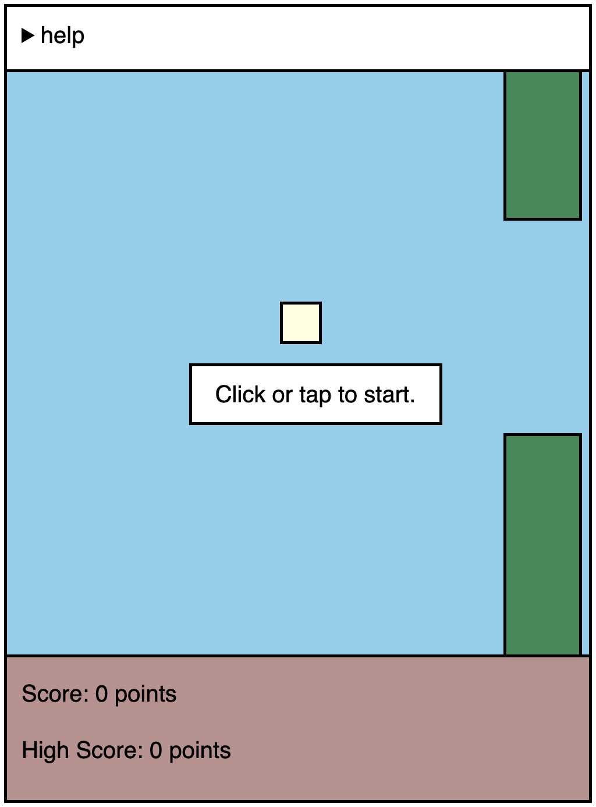
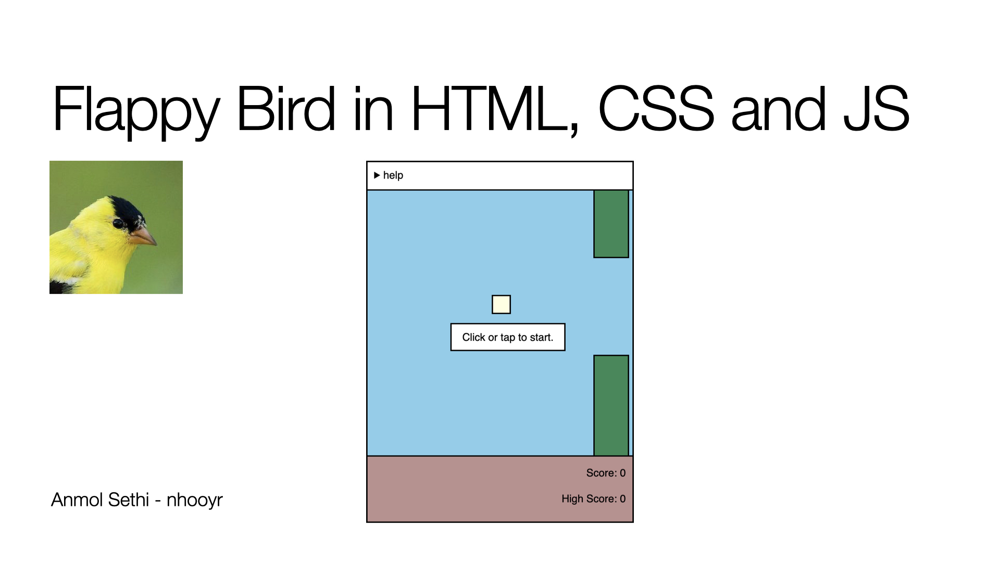

# flappy-bird 

https://nhooyr.github.io/flappy-bird/

I wrote this demo game for a short presentation I gave at the [Kaslo,
BC](https://jvh.sd8.bc.ca/) highschool to freshmen and sophmores on how HTML, CSS and JS
can be used to create simple web apps.

The presentation is in [./pres](./pres) and accessible at
https://nhooyr.github.io/flappy-bird/pres/.

Rest assured that if I were to make a real game, I would use canvas and not HTML elements
to drive the display. This was written purely for educational purposes.

note: This isn't an endorsement of HTML, CSS or JS. The HTML DOM just happens to be a
technology that dominates our industry and thus makes for a good software starter toolkit.
And it's what they were already learning from their teacher.

warning: This game is very addictive. Play at your own peril.

Email me directly if you have any questions or bugs to report.
